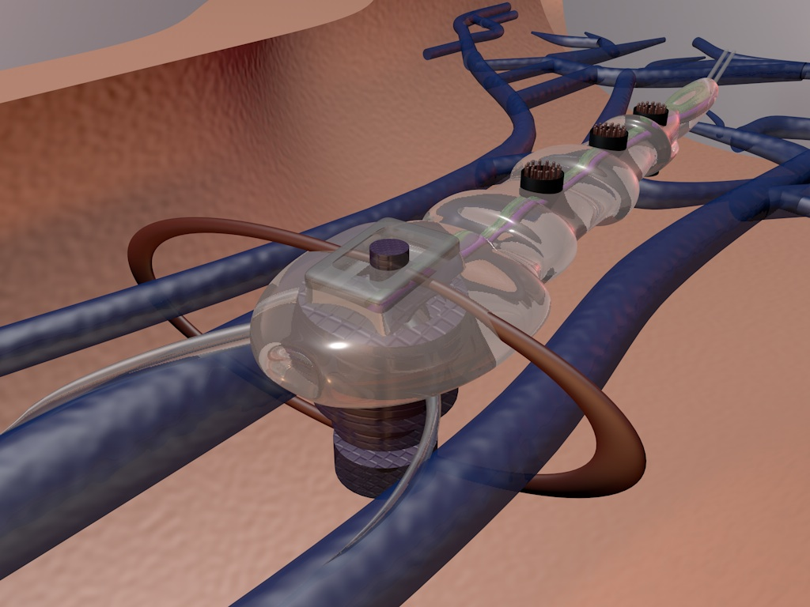
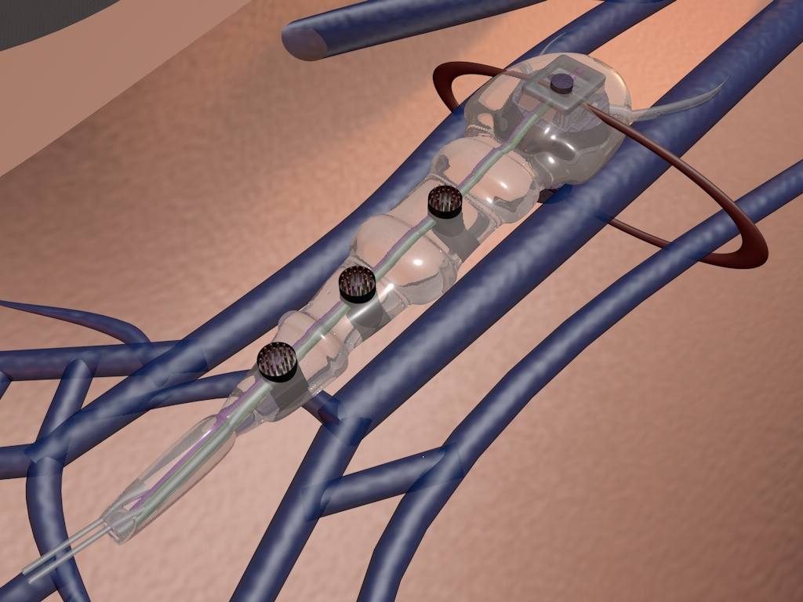

TremorBot is a device to combat essential tremors. The variability of the tremors means that taking the same amount of medication daily is counterintuitive. Instead, medication is injected into the TremorBot and it uses sensors to gauge the severity of the tremors and release the drug accordingly. 
 
 

