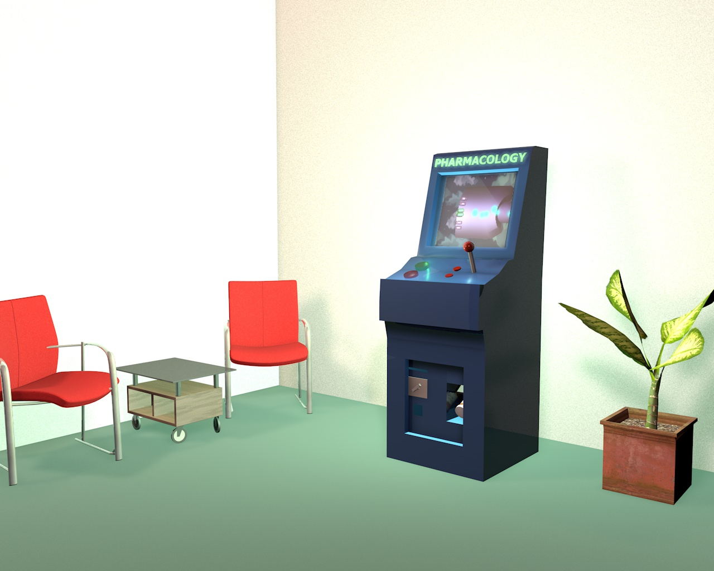
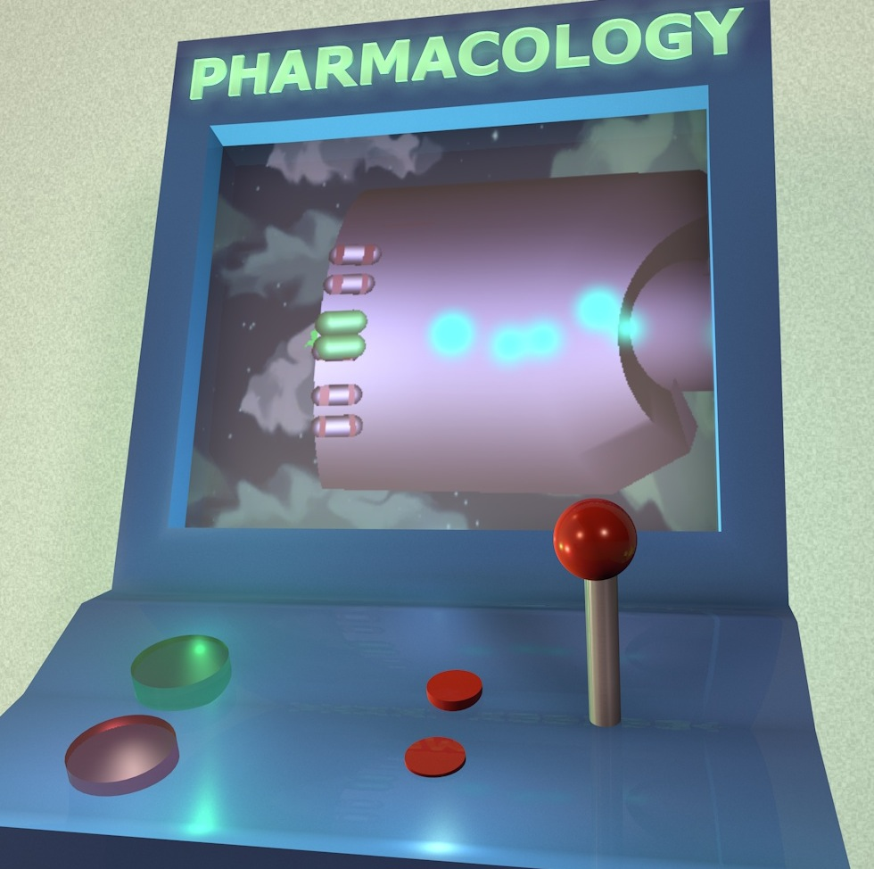
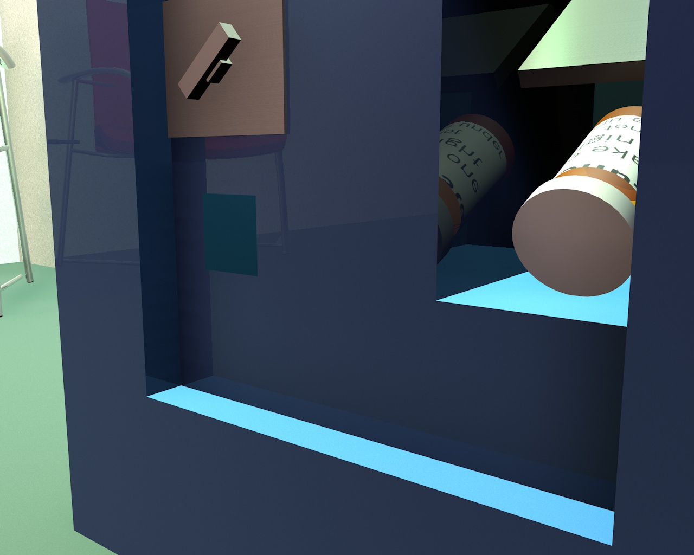

Pharmacology rethinks the way we are prescribed drugs. What if patients had to complete an arcade-style game depicting the drug's course through the body before it was issued to them as a prize? I explored this possibility through Lunesta, a drug to aid in sleep.
 

 
 

 
 

 
 

<iframe src="//player.vimeo.com/video/115175906?title=0&amp;byline=0&amp;portrait=0" width="800" height="400" frameborder="0" webkitallowfullscreen mozallowfullscreen allowfullscreen> </iframe>

 

<iframe src="//player.vimeo.com/video/115176497?title=0&amp;byline=0&amp;portrait=0" width="800" height="400" frameborder="0" webkitallowfullscreen mozallowfullscreen allowfullscreen> </iframe>
Video capture of part of the game, without sound.
 
